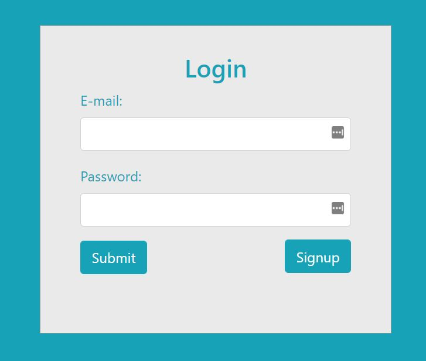

# My app
> Flask + MongoDB + Nginx as revers proxy in Dockerized environment and deployed to remote hosts by Ansible.

## Screenshots

## What is this application and how to use it
* On the main screen You can log in with "Submit" button, or You can register a new user  with "Sign up" button.
* If You registered a new user, then you can log in with "Submit" on Home page with the specified credentials.
* If You logged in successfully you see a confirmation message, and you can log out with "Logout" as well.
* Flash windows will appear if something is not OK, like:
    - Email not found!
    - Wrong password!
    - This email is already exists in the database!
    - There is already a user by that name!
    - Etc.

## For proper deploy with Ansible
* Have to add a user as "ansible" with sudo rights at the remote host.
* Have to modify the IP address of the remote host in hosts file at the remote host.
* Have to be preinstalled and up-to-date the below mentioned environments:
    - pip3
    - python3 (at least 3.6 or above)
* If the above mentioned requirements are Done, the deployment can be started with " ansible-playbook site.yml" command.
